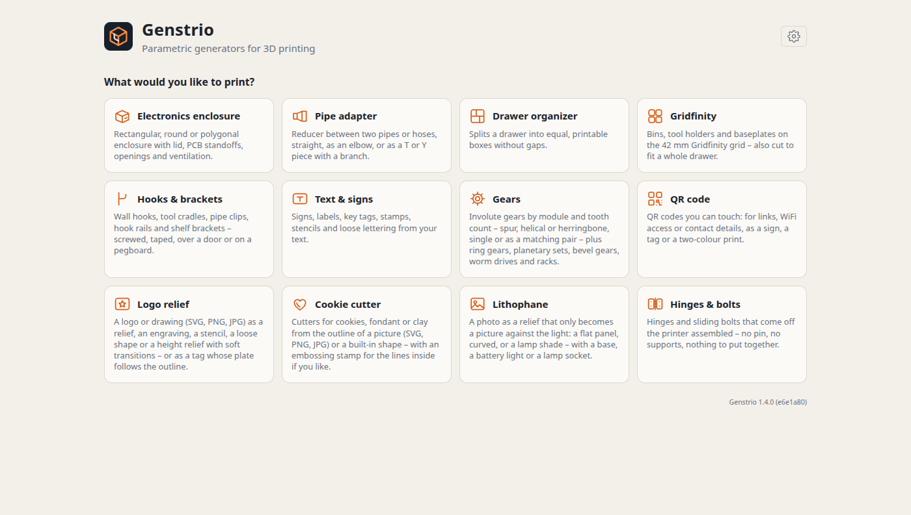
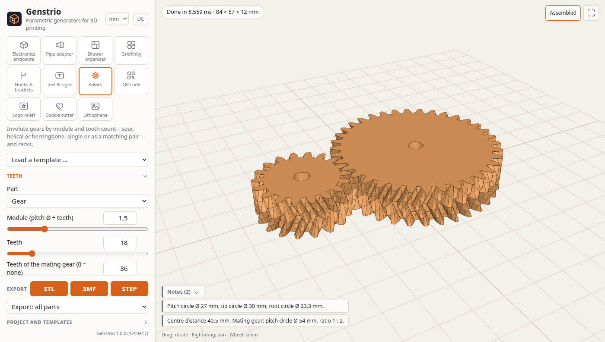
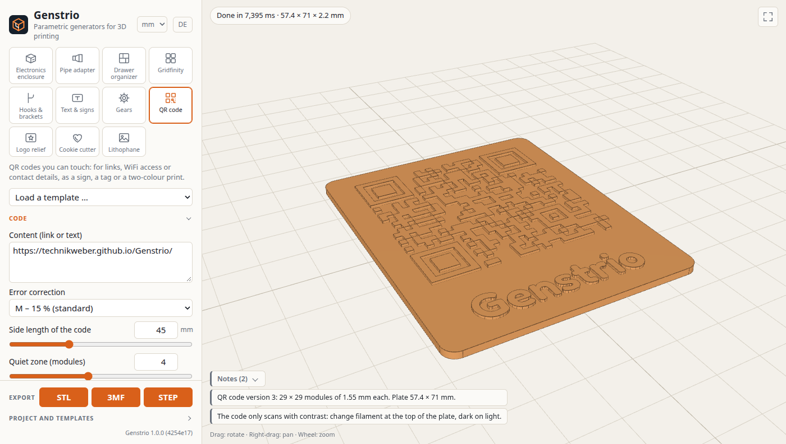
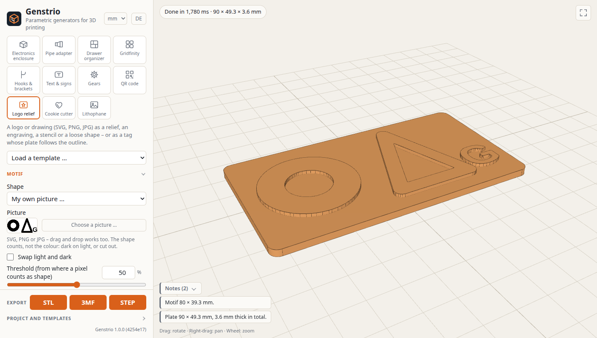
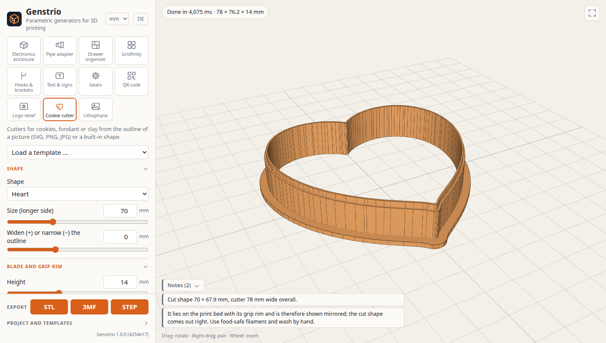
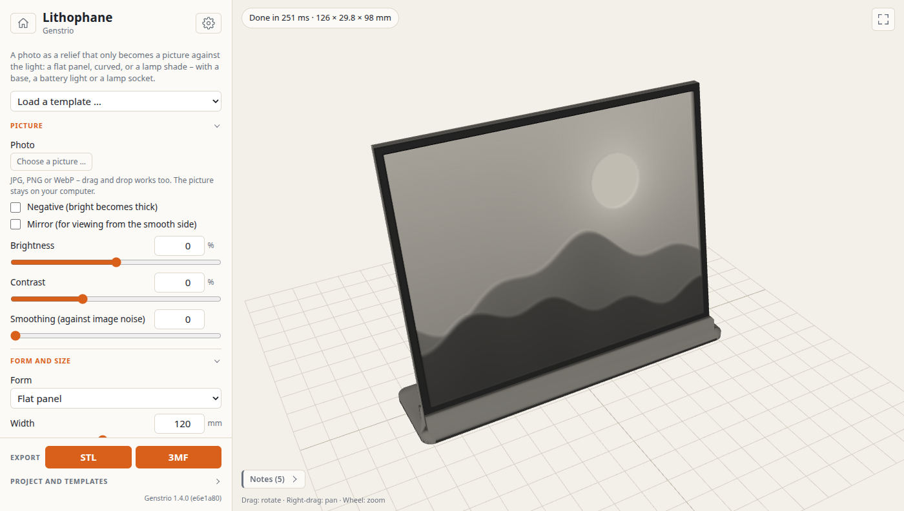
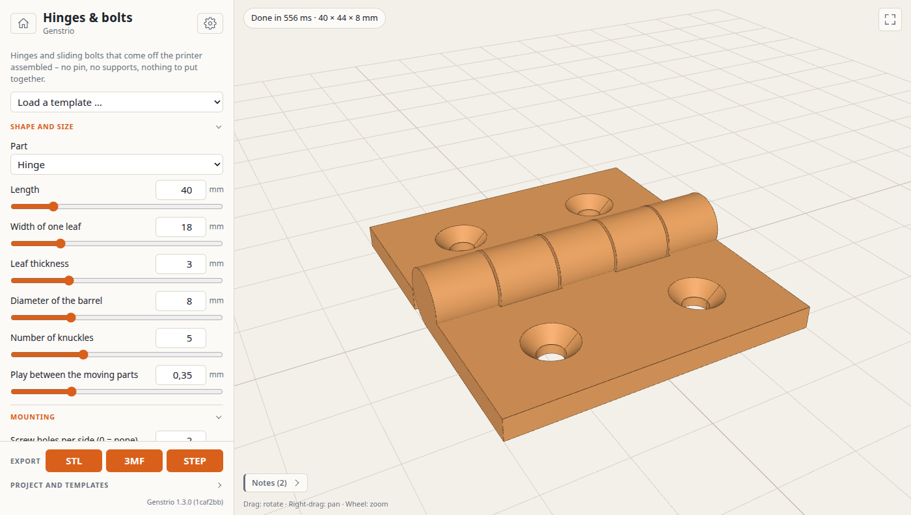
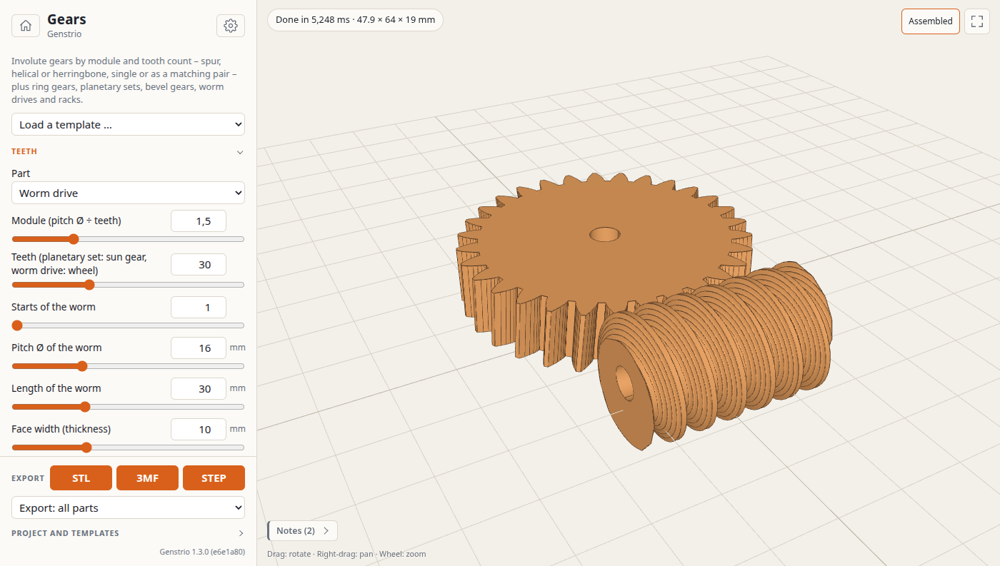

**English** · [Deutsch](README.de.md)

# Genstrio

**[▶ Open Genstrio in your browser](https://technikweber.github.io/Genstrio/)** – nothing to install.

Parametric generators for 3D printing. Enter a few dimensions, watch the model being built in 3D, and download it as **STL**, **3MF** or **STEP**.

Genstrio runs entirely in your browser: the geometry is computed locally by a real CAD kernel (OpenCascade compiled to WebAssembly). No account, no upload, no server-side processing – pictures you load for a relief, a cutter or a lithophane never leave your computer either.

The start page asks what you would like to print; the house symbol leads back to it from any generator. The interface starts in English; language, unit of length, light or dark appearance, the size of your print bed and an allowance for fits are set behind the cog symbol.

[](docs/images/enclosure.png)

## Generators

| Generator | What it makes |
| --- | --- |
| **Electronics enclosure** | Rectangular, round or polygonal (3–12 sides) box, with or without lid. **Templates** for Raspberry Pi 3/4/5, Zero and Pico, Arduino Uno and Mega, Adafruit Feather, ESP32 DevKit and BeagleBone place the standoffs on the board's hole pattern and cut the openings for its connectors; every value stays editable. PCB standoffs and lid screws are sized independently (M2–M5), as self-tapping pilot holes or heat-set insert holes; lid screws can be countersunk or counterbored. The lid can instead snap on, twist-lock (round bodies), or just push on, and can be hinged – with a pin, or snapped in without one. As a catch there is also a **sliding bolt** that prints in place on the lid and enters a keeper on the wall. Optional gasket groove, mounting ears (side, spacing and offset adjustable) and a DIN rail clip on any wall or under the floor. Any number of openings on walls, lid or floor: connectors (USB-C, Micro-USB, USB-A single and stacked, USB-B, HDMI, Mini/Micro-HDMI, RJ45, DC jack, SD slot), round holes with presets for antennas, LEDs, switches and buttons, cable glands (M12–M40, PG7–PG21, optionally with printed thread), speakers (20–77 mm) and fans (25–120 mm) behind a guard of holes, honeycomb, grid, slots or triangles, or fully open. Ventilation is set separately for lid, walls and floor. The lid can carry **text**, engraved or raised, in any of the fonts of the text generator. |
| **Pipe adapter** | Reducer between two pipes, hoses or threads. Each end is either a free diameter that plugs into its counterpart or slides over it (the diameter you enter always stays the mating surface, the wall grows away from it), or a standard size: garden hoses 1/2″–1 1/4″, G pipe threads 1/4″–1″ male or female, HT drain pipe DN 32–110, PVC pipe, vacuum and dust extraction ports. Templates cover hose joiners, tap and thread adapters, vacuum adapters, drain reducers and wall flanges. Hose barbs with count, height and spacing set per end, lead-in chamfers, a printable transition cone, an optional elbow of up to 180° and an optional mounting flange with bolt holes. A **branch** turns it into a T or Y piece with a third end at an angle of 30° to 90°. |
| **Drawer organizer** | Splits a drawer into boxes that fill it without gaps and fit your print bed, starting from templates for typical kitchen, desk, workshop and bathroom drawers: equal boxes, mixed sizes from ratios you type in (e.g. `2, 1, 1`), or a random mix of small and large boxes that you can roll again until you like it. Each box can have dividers (full or reduced height), finger notches in the rim, drain openings in the floor and a label ledge. |
| **Gridfinity** | Bins and baseplates on the 42 mm [Gridfinity](https://gridfinity.xyz) grid. Bins from 1 × 1 to 10 × 10 units with or without stacking lip, any number of compartments, lowered dividers, a scoop at the front, label ledges (full width, left, centred or right), adjustable wall and floor, and magnet and/or M3 screw holes in the corners or in every foot. Instead of an open bin you can make a **holder** with a field of pockets – for hex bits, AAA/AA/18650 cells, pens or any round, hexagonal or square size – or a solid block. Baseplates as an open frame or with a floor, magnet holes and countersunk holes to screw them down. Enter the **inside size of a drawer** and the plate fills it completely: the grid is centred or pushed to a side, the leftover becomes a solid rim, and plates larger than your print bed are split into pieces that fit; pieces that are the same after half a turn are built and exported only once. |
| **Hooks & brackets** | Wall hooks (reach, upturned tip, upward slope and bend radius adjustable), cradles fitted to the diameter of a handle or pipe, shelf brackets with a supporting rib and holes for the shelf, **pipe clips** that a pipe or cable snaps into, and rails with up to ten hooks or clips. Fastened with screws (countersunk or plain), adhesive tape, hung over a door of any thickness, or hooked into a pegboard. Single hooks come out lying on their side, so the layers run along the arm. |
| **Text & signs** | Signs, labels, key tags, stamps, stencils and loose lettering from one or more lines of text, in nine fonts. Text raised on a plate, engraved into it, cut through, or as letters alone with a bar that joins them. Rectangular, pill-shaped or elliptical plate with a raised border, holes for a key ring or screws, mirrored text for stamps, and the text as a separate part for printing in a second colour. |
| **Gears** | Involute gears by module, tooth count and pressure angle (14.5°, 20°, 25°): spur, helical or herringbone. Optionally with the matching mating gear straight away; the app states centre distance and ratio, and **Assembled** shows the gears in mesh. Bore round, with a flat for D shafts, hexagonal or square, plus a hub and adjustable backlash. Also **ring gears** with internal teeth, complete **planetary sets** (sun, planets, ring and a carrier with pins; the app checks that the planets can be spaced evenly and states the ratio) **bevel gear pairs** for axes at a right angle, **worm drives** made of worm and wheel, and racks with the same pitch. |
| **QR code** | QR codes for links, WiFi access or any text, raised on a plate or engraved into it, optionally as a separate part for a second colour. Error correction L to H, adjustable quiet zone, a hole for a key ring and a line of text below the code in any font of the text generator. The app states the module size and warns when it gets too fine for the nozzle. |
| **Logo relief** | Load a logo or drawing as **SVG, PNG or JPG** (or take a built-in shape) and print it as a relief, an engraving, a stencil or a loose shape. The plate is rectangular, elliptical, or follows the outline of the motif like the edge of a sticker, with a lug for a key ring. Threshold, smoothing and “swap light and dark” decide what counts as shape; the motif mirrored for stamps and as a separate part for a second colour. As a **height relief** the height follows the brightness of the picture without steps. |
| **Cookie cutter** | Cutters for cookies, fondant or clay from the outline of a picture or a built-in shape (heart, star, flower, moon, circle). A wall of the same thickness all round, a narrow cutting edge on top, a grip rim below; the outline can be widened or narrowed. Lies ready to print on its grip rim. For a picture of your own there is an optional **embossing stamp** that fits into the cutter and presses the lines or areas inside into the dough, with a plug-in grip. |
| **Lithophane** | A photo as a relief that only becomes a picture against the light: a flat panel, curved (stands on its own) or a cylinder for a lamp shade. Thinnest and thickest spot, frame and negative are adjustable; the preview shows the picture the way it looks lit from behind. To go with it, a **base with a slot**, optionally with a tilted seat for a round battery light behind it (diameter, thickness, tilt and distance adjustable), and for the cylinder a **lid for E27 or E14 lamp holders**. The picture can **lean back**, base and picture print separately or **in one piece**, braced by struts if wanted; instead of the battery light an LED tea light lying flat fits as well. Brightness, contrast, smoothing and mirroring prepare the photo, a plinth keeps the motif clear of the slot, and on curved forms the relief can face inwards. Exports as STL or 3MF. |
| **Hinges & bolts** | Hinges that come off the printer assembled: the knuckles hold on to each other with cones that print without supports, so no pin is needed. Length, leaf width, barrel, number of knuckles and play are adjustable, screw holes countersunk if wanted. Plus **sliding bolts** with a keeper, also printed in one piece. |

### Screenshots

[](docs/images/home.png)

| | |
| --- | --- |
| [](docs/images/adapter.png) | [](docs/images/organizer.png) |
| Pipe adapter: Y piece for three hoses | Drawer organizer: random mix of box sizes |
| [](docs/images/gridfinity.png) | [](docs/images/baseplate.png) |
| Gridfinity bin with compartments, scoop and label ledges | Gridfinity baseplates that fill a drawer, split for the printer |
| [](docs/images/hook.png) | [](docs/images/text.png) |
| Hooks & brackets: a key rail | Text & signs: door sign with border and screw holes |
| [](docs/images/gear.png) | [](docs/images/qr.png) |
| Gears: a planetary set, assembled | QR code with a label |
| [](docs/images/relief.png) | [](docs/images/cutter.png) |
| Logo relief from an SVG file | Cookie cutter with embossing stamp and grip |
| [](docs/images/lithophane.png) | [](docs/images/hinge.png) |
| Lithophane: tilted, with base and struts in one piece | Hinges & bolts: prints assembled |
| [](docs/images/worm.png) | |
| Gears: worm drive | |

What is planned next is in the [Roadmap](#roadmap).

## Run it locally

The hosted version above is all you need. To run Genstrio on your own machine, you need [Node.js](https://nodejs.org) 20.19 or newer.

```bash
git clone https://github.com/TechnikWeber/Genstrio.git && cd Genstrio && ./genstrio
```

The first start installs the dependencies and builds the app (about a minute), then opens it in your browser at `http://localhost:4173`. Later starts take a second.

### Install as a desktop app (Linux)

```bash
./genstrio --install
```

This adds **Genstrio** to your application menu and a `genstrio` command to `~/.local/bin`. The menu entry opens Genstrio in its own window if Chromium, Chrome or Brave is installed, otherwise in your default browser. The background server stops by itself shortly after you close the window. Keep the cloned folder where it is; the launcher points to it. `./genstrio --uninstall` removes both again.

### Launcher options

| Command | Effect |
| --- | --- |
| `./genstrio` | Build if needed, start the local server, open the browser |
| `./genstrio --window` | Open in a chromeless app window |
| `./genstrio --no-open` | Start the server only |
| `./genstrio --dev` | Development server with hot reload |
| `./genstrio --rebuild` | Force a fresh build |

Set `GENSTRIO_PORT` to use a port other than 4173.

## Hosting

`npm run build` writes a fully static site to `dist/`. It uses relative paths, so it can be served from any folder of any static host, including GitHub Pages. The CAD kernel is a 23 MB WebAssembly file (about 7 MB compressed) that the browser caches after the first visit.

## Using the exports

- **STL** contains all parts in one mesh, laid out for printing.
- **3MF** contains each part as a separate object.
- **STEP** contains the exact CAD geometry, for further editing in FreeCAD, Fusion and the like. A lithophane is a triangle mesh and can therefore only be saved as STL or 3MF.

Dimensions can be shown and entered in millimetres, centimetres or inches (selector in the settings behind the cog symbol; inches also as fractions such as `3 1/2`); exported files are always in millimetres. If a model has several parts, the selector below the export buttons lets you download just one of them, for example only the lid. The drawer organizer exports each box size once; the app tells you how many to print.

## Saving your work

Your values are kept in the browser between visits. Under **Project and templates** you can also save the current values as a named template of your own, download them as a project file (`.json`) to continue later or on another computer, and open such a file again. **Copy link** puts the current generator and all its values into a link you can bookmark or share. **Assembled** in the preview shows the lid in place on the body.

## Development

```bash
npm install
npm run dev        # dev server with hot reload
npm test           # geometry tests (run the CAD kernel in Node)
npm run typecheck
npm run build
```

How the code is organised:

- `src/generators/meta.ts` declares each generator's parameters. The form is rendered from this.
- `src/generators/build/` holds the geometry, written with [replicad](https://replicad.xyz). Each generator is a JavaScript generator function that yields intermediate stages, which is how the preview shows the model growing step by step.
- `src/engine/worker.ts` runs the CAD kernel in a web worker, so the interface stays responsive.
- `src/viewer.ts` is the three.js preview, `src/i18n.ts` holds the English and German texts.

Board hole patterns live in `src/generators/boards.ts`, templates in `src/generators/templates.ts`.

Pictures are reduced to a small greyscale bitmap in the browser (`src/picture.ts`, `src/generators/image.ts`) and stored like any other value. `src/generators/build/trace.ts` turns that into a distance field and traces its contour lines: the line at 0 is the outline, any other the same outline evenly widened or narrowed – which is how a cutter gets its wall.

To add a generator, declare its parameters in `meta.ts`, write a build function, register it in `build/index.ts`, and add its texts to `i18n.ts`.

## Roadmap

- More board templates, including the connector cutouts of BeagleBone and other single-board computers
- More fittings: quick couplings, cross pieces, pipe clamps with a cap
- Gears: bevel gears for other shaft angles, pulleys
- Lithophanes: sphere, night light with a base for an LED holder
- Enclosures: battery compartments, cable strain reliefs

## License

[AGPL-3.0-or-later](LICENSE). The models you generate are yours, without restriction.

Genstrio builds on [replicad](https://github.com/sgenoud/replicad) (MIT), [OpenCascade](https://dev.opencascade.org) (LGPL-2.1), [three.js](https://threejs.org) (MIT), [fflate](https://github.com/101arrowz/fflate) (MIT) and [qrcode-generator](https://github.com/kazuhikoarase/qrcode-generator) (MIT). “QR Code” is a registered trademark of DENSO WAVE.

The fonts of the text generator – Inter, Fredoka, Oswald, Bebas Neue, Zilla Slab, Playfair Display, JetBrains Mono, Pacifico and Allerta Stencil – are licensed under the [SIL Open Font License 1.1](https://openfontlicense.org), which allows free use, also commercially, in anything you make with them. The font files and their licence texts are in [`src/fonts`](src/fonts).
